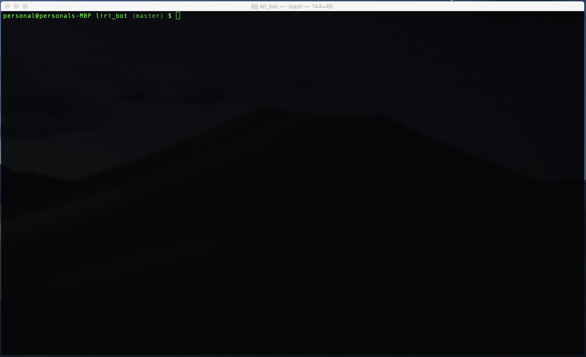
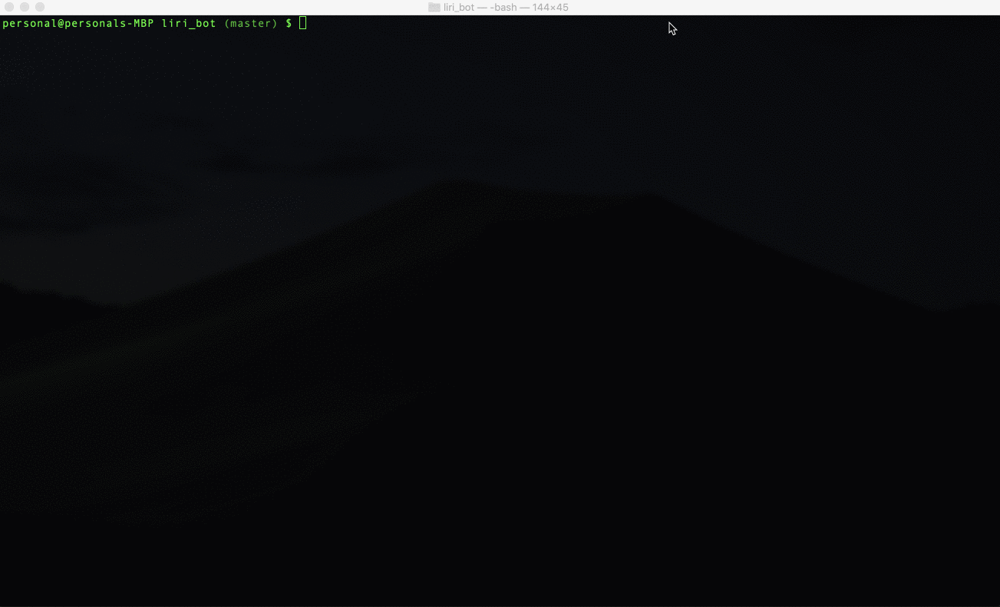
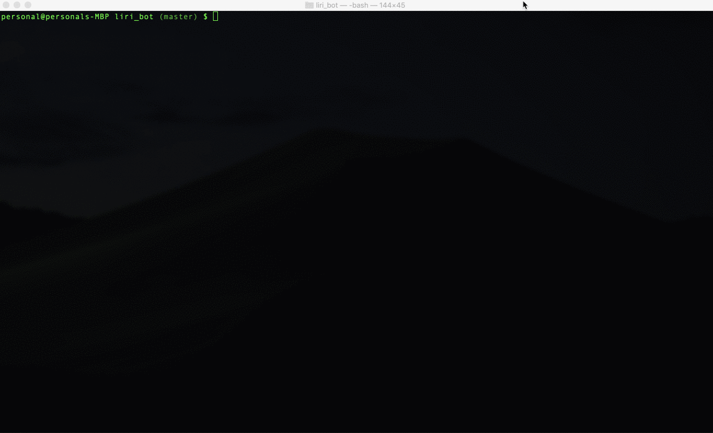

# LIRI Bot

## Description

This is a command line node app (CLI) that takes in parameters and gives back data via the command line or by modifying randiom.txt

This assignment had us use these languages and modules below:

* Javascript
* Node
* Axios 
* fs
* DotEnv
* Moment - (did not get to work)

## Instructions

Clone the repo to a local file and first initiate npm and then run npm install to initalize the packages. After storing your API keys and installing the packages, the flow of the four programs to run are outlined below:

In the directory, run 

node liri.js [programToRun]

1. concert-this 

To search for a concert: (default is Ariana Grande) put quotes around your entry if entering an artist

2. spotify-this-song

To search for a song on Spotify: (default is Break Up With Your Girlfriend by Ariana Grande)

3. movie-this 

To search for a movie: (default is Mean Girls)

4. do-what-it-says

To get data from random.txt, (Danity Kane, Mean Girls, Back Street Boys

## Feedback

If you have feedback on code or find a bug please let me know, I was not able to get moment,.js working to format the date of the concerts in MM-DD-YYY format.

